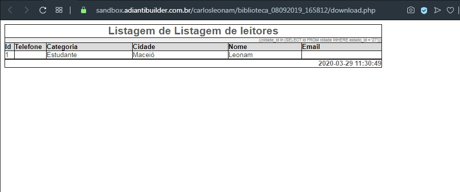

# **Generator Report ( HTML, PDF, RTF and XLS ) for Adianti in TDatagrid**
> Generate report direct from TDatagrid
<!--
[![NPM Version][npm-image]][npm-url]
[![Build Status][travis-image]][travis-url]
[![Downloads Stats][npm-downloads]][npm-url]
-->

What is it? Simple! This is a extended classes from Adianti reports, for using inside TDatagrid class.
>O que é isso? Simples! Esta é uma classe estendida dos relatórios do Adianti, para uso dentro da classe TDatagrid.

We use this hack to get current columns width to adapt report for best preview, and use cookies for that.
>Usamos esse hack para obter a largura atual das colunas para adaptar o relatório para a melhor visualização e usamos cookies para isso.


## **Installation**

### **Download:**

Download latest release, and extract to a subdir in 'app/lib', like 'sislib' or whatever you want (making code changes).
>Faça o download da versão mais recente e extraia para um subdiretório em 'app/lib', como 'sislib' ou o que quiser (fazendo os ajustes no código).

**Linux:**

```sh
cd /app/lib
mkdir sislib     // or witchever you prefer (but make manual adapter on source code)
mkdir sislib/src // or witchever you prefer (but make manual adapter on source code)
```

**Windows:**

```sh
cd \app\lib
md sislib       // or witchever you prefer (but make manual adapter on source code)
md sislib/src   // or witchever you prefer (but make manual adapter on source code)
```

**Adianti Builder**
Hosted localhost code:

Presumed that you had knowledge how Builder works. So, go ahead:
>Presume-se que você tenha conhecimento de como o Builder funciona. Então vá em frente:

With previous download package zip file, descompact in local computer folder, inside 'app/lib/sislib/src'. The idea is to create same classes inside your Builder project.
>Com o arquivo zip do pacote de download anterior, descompacte na pasta do computador local, dentro de 'app/lib/sislib/src'. A ideia é criar as mesmas classes dentro do seu projeto Builder

**Builder online test:**


Simple to do, just mirror all classes within the Builder, creating "new-code" with the name of each class, and paste (overlapping everything!) The content of each one within the created class.
>Simples de fazer, basta espelhar todas as classes dentro do Builder, criando "novo-codigo" com o nome de cada classe, e colar (sobrepondo tudo!) o conteúdo de cada uma dentro da classe criada.


Result after make a search, because it's obrigatory (exists a alert with Sweet alert, but )

### Composer:
> Remember, Adianti Framework has a particular method to load your built in classes. Cause of that, the installation of this generator has following the below passes.

A little bit more complex, but it works.
<!--
Before use it, run this command to add in your composer the package (https://github.com/mnsami/composer-custom-directory-installer):
```sh
composer require mnsami/composer-custom-directory-installer
```
 -->
Insert this below lines, in appropriate local, inside your composer.json (**please, remember backup you "composer.json" file before!**)
>Insira as linhas abaixo, no local apropriado, dentro do seu composer.json (** lembre-se de fazer backup do arquivo "composer.json" antes! **)
```sh
{
    "repositories": [
       { "type": "git", "url": "https://github.com/carlosleonam/listreport" }
    ],


    "extra": {
        "installer-paths":{
        "app/lib/sislib/": ["carlosleonam/listreport"]
        }
    }
}
```

After that, install package for personalize install directory:
>Depois disso, instale o pacote para personalizar o diretório de instalação:
```sh
composer require mnsami/composer-custom-directory-installer
```

This to use SweetAlert2 messages:
>Isso para usar as mensagens SweetAlert2:
```sh
composer require varunsridharan/sweetalert2-php
```

And finally, install our package:
>E finalmente, instale nosso pacote:
```sh
composer require carlosleonam/adianti_list_report
```

## Usage example
>Exemçlo de uso

### In your class that has TDatagrid inside it
>Na sua classe que tem TDatagrid dentro dele

Insert this below code in appropriate place in your class (in general, before __construct method). See example:
>Insira este código abaixo no local apropriado da sua classe (em geral, antes do método __construct). Consultar exemplo:

```php
class MyClass extends TPage
{
    private $form; // form
    private $datagrid; // listing
    private $pageNavigation;
    private $loaded;
    private $filter_criteria;
    private static $database = 'database_conector';
    private static $activeRecord = 'MyModel';
    private static $primaryKey = 'id';
    private static $formName = 'formList_MyClass';
    private $showMethods = ['onReload', 'onSearch'];

    #------[ BEGIN CODE TO INSERT ]---------------------------------

    // Number of buttons column's
    private static $buttons_columns = 1;
    // Array of position of columns that has total
    private static $columns_with_total = [6];
    // Trait to HTML, PDF, RTF and XLS
    use TGeneratorReportTrait;

    #------[ /END CODE TO INSERT  ]---------------------------------

    /**
     * Class constructor
     * Creates the page, the form and the listing
     */
```

And, before end of __construct method, insert this lines:
>E, antes do final do método __construct, insira estas linhas:

```php
        #------[ BEGIN CODE TO INSERT ]---------------------------------

        include_once('app/lib/sislib/src/ReportButtons.php');
        include_once('app/lib/sislib/src/tdatagrid_colwidth.php');

        #------[ /END CODE TO INSERT  ]---------------------------------

        parent::add($container);
    }
```

Now, after Composer has been updated or downloaded to the appropriate folder (app/lib/sislib/src), reload your class and enjoy.
>Agora, após a atualização ou o download do Composer para a pasta apropriada (app/lib/sislib/src), recarregue sua classe e aproveite.

... this is an incomplete README.md file, because it is just for me or someone who needs it. I will try to make a better document when I have time. Sorry about that, and my bad English too! Bye!
>... este é um arquivo README.md incompleto, porque é apenas para mim ou para alguém que precise dele. Vou tentar fazer um documento melhor quando tiver tempo. Desculpe por isso, e meu inglês ruim também! Tchau!'

<!--
A few motivating and useful examples of how your product can be used. Spice this up with code blocks and potentially more screenshots.

_For more examples and usage, please refer to the [Wiki][wiki]._

## Development setup

Describe how to install all development dependencies and how to run an automated test-suite of some kind. Potentially do this for multiple platforms.

```sh
make install
npm test
```

## Release History

* 0.2.1
    * CHANGE: Update docs (module code remains unchanged)
* 0.2.0
    * CHANGE: Remove `setDefaultXYZ()`
    * ADD: Add `init()`
* 0.1.1
    * FIX: Crash when calling `baz()` (Thanks @GenerousContributorName!)
* 0.1.0
    * The first proper release
    * CHANGE: Rename `foo()` to `bar()`
* 0.0.1
    * Work in progress

## Meta

Your Name – [@YourTwitter](https://twitter.com/dbader_org) – YourEmail@example.com

Distributed under the XYZ license. See ``LICENSE`` for more information.

[https://github.com/yourname/github-link](https://github.com/dbader/)

## Contributing

1. Fork it (<https://github.com/yourname/yourproject/fork>)
2. Create your feature branch (`git checkout -b feature/fooBar`)
3. Commit your changes (`git commit -am 'Add some fooBar'`)
4. Push to the branch (`git push origin feature/fooBar`)
5. Create a new Pull Request

<~!-- Markdown link & img dfn's --~>
[npm-image]: https://img.shields.io/npm/v/datadog-metrics.svg?style=flat-square
[npm-url]: https://npmjs.org/package/datadog-metrics
[npm-downloads]: https://img.shields.io/npm/dm/datadog-metrics.svg?style=flat-square
[travis-image]: https://img.shields.io/travis/dbader/node-datadog-metrics/master.svg?style=flat-square
[travis-url]: https://travis-ci.org/dbader/node-datadog-metrics
[wiki]: https://github.com/yourname/yourproject/wiki
-->